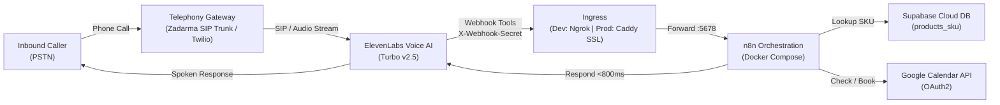

# Autonomous Inbound Call Admin Agent

> **Turnkey, modular, self-hosted telephony voice agent powered by local n8n, ElevenLabs Conversational AI, Zadarma (SIP Trunking) / Twilio, Supabase Cloud, and Google Calendar.**

---

## 1. System Overview

The **Autonomous Inbound Call Admin Agent** is an end-to-end voice automation platform that handles inbound telephone calls for local businesses (such as automotive repair centers, dental and medical clinics, beauty salons, and professional service firms). 

The caller speaks naturally with an **ElevenLabs Conversational AI** voice agent connected to a business phone number via **Zadarma SIP Trunking** (with zero per-minute inbound carrier fees) or **Twilio**. The agent seamlessly triggers local/self-hosted **n8n** workflows via secure webhooks to:
1. **Query Product Inventory & Pricing:** Look up real-time stock levels, SKU codes, and pricing from a **Supabase Cloud** PostgreSQL database.
2. **Check Calendar Availability:** Query real-time open slots on **Google Calendar** via OAuth2.
3. **Book Appointments:** Schedule confirmed appointments directly onto Google Calendar with customer details and purpose.
4. **Answer Administrative Questions:** Instant answers to business hours, location, accepted payments, and policies configured in the agent prompt and knowledge base.
5. **Log Call Telemetry:** Persist caller metadata, call duration, transcripts, and customer intent into Supabase after every call.



---

## 2. Key Architecture Benefits

- **Ultra-Low Voice Latency:** Audio processing and conversational turn-taking are handled directly by ElevenLabs Conversational AI with native SIP/audio streaming (<500ms voice turn).
- **Zero Inbound Carrier Minute Cost with Zadarma:** Zadarma provides flat-rate virtual phone numbers with **free unlimited inbound calls** ($0.00/minute), eliminating per-minute carrier telephony fees.
- **Zero Dead-Air Design:** The agent utters natural vocal acknowledgments (*"Let me check our stock on that..."*) before executing tools, masking webhook latency entirely.
- **Local / Self-Hosted Independence:** Business logic and third-party integrations run inside self-hosted n8n (`docker-compose.yml`) with zero per-workflow platform fees.
- **Dev-to-Prod Ingress Path:** Start local development using **Ngrok** tunneling in minutes; transition to online production without Ngrok using **Caddy/Nginx** reverse proxy and automated Let's Encrypt SSL.
- **Modular & Client-Portable:** White-label a new client by editing a single `config/business-profile.yaml` and running `scripts/render_config.py`, which regenerates the agent prompt, ElevenLabs config, and FAQ. First-time infrastructure setup (Docker, Supabase, Google OAuth, ElevenLabs, telephony) takes ~30–45 minutes; each subsequent client is ~15 minutes once templated.
- **Compelling Unit Economics:** Infrastructure operating costs are **~$10 to $28/month fixed** with near-zero carrier fees. See [`docs/03 COMMERCIAL ANALYSIS/commercial_analysis.md`](docs/03%20COMMERCIAL%20ANALYSIS/commercial_analysis.md).

---

## 3. Repository Structure

```text
.
├── setup.sh                       # One-command local install (env, boot, import + activate workflows)
├── docker-compose.yml             # Docker Compose specification for local n8n
├── .env.example                   # Environment configuration template
├── .gitignore                     # Git ignore rules protecting secrets (.env)
├── config/
│   ├── business-profile.yaml      # SINGLE SOURCE OF TRUTH for white-labeling a client
│   ├── templates/                 # Prompt / agent-config / FAQ templates (${...} placeholders)
│   └── examples/                  # The filled Acme example of each rendered file
├── scripts/
│   └── render_config.py           # Renders elevenlabs/* + syncs .env from business-profile.yaml
├── contracts/
│   └── elevenlabs-tools/          # Copy-paste ElevenLabs tool defs (per tool, placeholder URL/secret)
├── database/
│   ├── schema.sql                 # Supabase PostgreSQL schema (products_sku, call_logs)
│   └── seed.sql                   # Sample business inventory and test call logs
├── workflows/
│   ├── sku-lookup.json            # n8n workflow: POST /webhook/sku-lookup
│   ├── calendar-check.json        # n8n workflow: POST /webhook/calendar-check
│   ├── calendar-book.json         # n8n workflow: POST /webhook/calendar-book
│   └── call-summary-logger.json   # n8n workflow: POST /webhook/call-summary-logger
├── elevenlabs/                    # Generated by render_config.py — do not hand-edit
│   ├── agent-config.json          # Full ElevenLabs agent settings export
│   ├── agent-prompt.md            # System prompt directives, tone, and tool rules
│   └── business-faq-template.md   # Client FAQ for the ElevenLabs knowledge base
└── docs/
    ├── 01 AUDIT/
    │   └── AS_IS.md               # Complete architecture, sequence diagrams & latency analysis
    ├── 02 PLAYBOOK/
    │   └── production-ops-runbook.md # Operations, Ngrok setup, prod deployment & troubleshooting
    └── 03 COMMERCIAL ANALYSIS/
        └── commercial_analysis.md # Comprehensive business case, ROI & packaging model
```

---

## 4. Quickstart Guide (Local Development with Ngrok)

> **Fast path (recommended):** run the installer, which creates `.env`, generates a secure
> `WEBHOOK_SECRET`, renders the ElevenLabs config from `config/business-profile.yaml`, boots
> n8n, and **auto-imports + activates all four workflows**:
> ```bash
> ./setup.sh
> ```
> It then prints the remaining steps that must be done in external services (Supabase, ngrok,
> Google OAuth, ElevenLabs, telephony) — those are covered manually below.

### Step 0: White-label the business (optional, before first run)
Edit `config/business-profile.yaml` (name, persona, timezone, currency, hours, bookable `slots`,
voice) and render the ElevenLabs assets + sync scheduling values into `.env`:
```bash
python3 scripts/render_config.py
```
This regenerates `elevenlabs/agent-prompt.md`, `elevenlabs/agent-config.json`, and
`elevenlabs/business-faq-template.md`. Do not hand-edit those files — edit the profile and re-render.

### Step 1: Environment Configuration
Copy the sample environment file and set a secure webhook secret:
```bash
cp .env.example .env
```
Set `WEBHOOK_SECRET` in `.env` to a random string (e.g. `openssl rand -hex 16`).
> **Important:** write the value **without surrounding quotes** and keep every line in `KEY=value`
> form — a stray or malformed line makes docker compose silently ignore the entire `.env`.

### Step 2: Start Local n8n Hub
Ensure Docker is installed and running, then boot the container:
```bash
docker compose up -d
```
Open `http://localhost:5678` in your browser to complete your local n8n administrator account setup.
> **Note on Cookies & Safari:** For local HTTP access (and Safari), `N8N_SECURE_COOKIE=false` is pre-configured in `.env` and `docker-compose.yml` to prevent browser cookie rejections.

### Step 3: Launch Ngrok Tunnel
Expose n8n port `5678` to the internet so ElevenLabs webhooks and Google OAuth callbacks can reach it:
```bash
ngrok http 5678
```
Copy your forwarding URL (e.g., `https://xyz-123.ngrok-free.app`) and set `WEBHOOK_URL` in `.env`. Recreate the container to apply:
```bash
docker compose up -d --force-recreate n8n
```

### Step 4: Set Up Supabase Database
1. Create a free project at [supabase.com](https://supabase.com).
2. If the "Connect to your project" modal appears, close it to view the main project dashboard.
3. Open the **SQL Editor** (icon `>_` on the left navigation bar), paste `database/schema.sql`, and click **Run**.
4. Open a new query, paste `database/seed.sql`, and click **Run** to load sample inventory items and test call logs.
5. In **Project Settings** > **API** (or **API Keys**), copy:
   - **Project URL** -> `SUPABASE_URL` in `.env`
   - **anon / public key** -> `SUPABASE_ANON_KEY` in `.env`
   - **service_role / secret key** (`sb_secret_...`) -> `SUPABASE_SERVICE_ROLE_KEY` in `.env`

### Step 5: Import Workflows & Configure Self-Hosted Credentials in n8n

#### 5.1 Import Workflows
> If you ran `./setup.sh`, all four workflows are already imported and activated — skip to 5.2.

To import manually inside the n8n canvas (`http://localhost:5678`):
1. Navigate to **Workflows** > **Import from File**.
2. Import `workflows/sku-lookup.json`, `workflows/calendar-check.json`, `workflows/calendar-book.json`, and `workflows/call-summary-logger.json`.

> **Note:** after importing on a fresh machine, open `calendar-check` and `calendar-book` and
> re-select your Google Calendar credential (credential IDs are instance-specific).

#### 5.2 Configure Google Calendar OAuth2 (Self-Hosted Setup)
Because self-hosted n8n runs independently on your infrastructure, there is no pre-baked 1-click Google OAuth button. You must register your own free OAuth 2.0 client in Google Cloud Console:
1. **Enable Google Calendar API**:
   - Open [Google Cloud Console](https://console.cloud.google.com/) and create or select a project.
   - Go to **APIs & Services** > **Library**, search for **Google Calendar API**, and click **Enable**.
2. **Configure Consent Screen**:
   - Go to **APIs & Services** > **OAuth consent screen**, choose **External**, and enter an App name and support email.
   - **Crucial**: Under **Test Users**, click **+ Add Users** and add the Google/Gmail account whose calendar you want to connect.
3. **Generate OAuth Client ID**:
   - Go to **APIs & Services** > **Credentials** > **+ Create Credentials** > **OAuth client ID**.
   - Select Application Type: **Web application**.
   - Under **Authorized redirect URIs**, click **+ Add URI** and paste your n8n callback URL:
     `https://<YOUR_WEBHOOK_URL>/rest/oauth2-credential/callback`
     *(e.g., `https://xyz-123.ngrok-free.app/rest/oauth2-credential/callback`)*
   - Click **Create** and copy your **Client ID** and **Client Secret**.
4. **Authorize in n8n (Important Domain Step)**:
   - **Crucial to avoid `{"status":"error","message":"Unauthorized"}`:** You **must** open n8n in your browser using your public Ngrok URL (e.g. `https://xyz-123.ngrok-free.app`), **not** `localhost`.
     > *Why?* Google redirects back to your public callback domain. If you are logged in on `localhost`, the browser will not have session cookies for the Ngrok domain, causing n8n to reject the callback as unauthenticated.
   - Inside n8n on the Ngrok URL, go to **Credentials** > **Add Credential** > **Google Calendar OAuth2 API**.
   - Paste your **Client ID** and **Client Secret**.
   - Click **"Sign in with Google"** / **"Connect my account"**, complete Google consent (click *Advanced > Go to app* if prompted about unverified apps), and click **Save**.
   - Once saved, the credentials persist locally and you can return to using `localhost:5678`.
5. Activate each imported workflow by toggling the switch in the top right to **Active**.

### Step 6: Configure ElevenLabs Conversational AI
1. Go to [elevenlabs.io](https://elevenlabs.io) > **Conversational AI** > **Create Agent**.
2. Paste the prompt from `elevenlabs/agent-prompt.md`.
3. Upload `elevenlabs/business-faq-template.md` to the **Knowledge Base**.
4. Add the three caller-facing webhook tools — `lookup_sku`, `check_availability`, `book_appointment`. Copy-paste-ready definitions are in [`contracts/elevenlabs-tools/`](contracts/elevenlabs-tools/); in each, replace `{{NGROK_OR_DOMAIN}}` with your forwarding host and `{{WEBHOOK_SECRET}}` with your secret.
   - **Tool URLs must include the `/webhook/<name>` path**, and request bodies must be **flat** (no wrapper object) — a bare-domain URL or a nested body is the most common cause of tools silently failing.
5. Add the fourth tool, `post_call_summary_logger` (`contracts/elevenlabs-tools/post_call_summary_logger.json`). **Recommended:** wire it as the ElevenLabs **post-call webhook** (Agent → **Settings → Webhooks**) rather than an LLM tool, so the real transcript and metadata are delivered automatically instead of being generated by the model.

### Step 7: Connect Telephony (Zadarma SIP Trunk or Twilio)

#### Option A: Zadarma SIP Trunking (Recommended for Flat-Rate / $0 Inbound Fees)
1. **Acquire Number & SIP Credentials in Zadarma:**
   - Log in to [Zadarma](https://zadarma.com) and purchase a virtual phone number (DID) in your target country/city.
   - Go to **Settings** > **SIP Connection** (or **My PBX** > **Extensions**). Note:
     - **SIP Server:** `pbx.zadarma.com`
     - **SIP Login / Extension:** (e.g. `123456-100`)
     - **SIP Password:** (your extension password)
2. **Import SIP Trunk into ElevenLabs:**
   - In [elevenlabs.io](https://elevenlabs.io), go to **Conversational AI** > **Phone Numbers**.
   - Click **Import Number** > **From SIP Trunk**.
   - Enter your Zadarma number in E.164 format (e.g. `+15551234567` or `+390612345678`).
   - Enter `pbx.zadarma.com` as the gateway and your Zadarma extension login and password. Leave Media Encryption set to `Disabled`.
   - Assign the imported number to your agent.
3. **Route Inbound Calls in Zadarma:**
   - In Zadarma under **My PBX** > **Inbound Calls**, route incoming calls for that number to your configured extension.
   - *(Optional)* Add a fallback rule to forward calls to a human mobile phone if the AI line is busy.

#### Option B: Twilio Integration
Link your Twilio inbound phone number directly to the ElevenLabs Agent ID in the Twilio Console (or via ElevenLabs' native Twilio integration).

Place a live telephone call to your number to experience the end-to-end voice assistant!

---

## 5. Transitioning to Production without Ngrok

For a 24/7 business deployment, Ngrok is eliminated in favor of a low-cost VPS ($4–$6/mo) with Caddy or Nginx providing automated SSL:
1. Point an A-record (`n8n.yourcompany.com`) to your server IP.
2. Configure **Caddy** to reverse-proxy port `5678` with automatic Let's Encrypt certificates.
3. Update `WEBHOOK_URL=https://n8n.yourcompany.com/` in `.env`.
4. Point your ElevenLabs tools to the static production domain.

Refer to the complete production walkthrough in [`docs/02 PLAYBOOK/production-ops-runbook.md`](docs/02%20PLAYBOOK/production-ops-runbook.md).

---

## 6. Maintenance

### Change the business profile (white-labeling)
Edit `config/business-profile.yaml`, then re-render and reload:
```bash
python3 scripts/render_config.py        # regenerates elevenlabs/* and syncs .env
docker compose up -d --force-recreate   # loads updated scheduling env into n8n
```
Then re-upload `elevenlabs/agent-prompt.md`, `agent-config.json`, and `business-faq-template.md` to your ElevenLabs agent.

### Rotate the webhook secret
Rotate `WEBHOOK_SECRET` periodically, and always after any exposure (e.g. it appeared in a screenshot or log):
```bash
./scripts/rotate_secret.sh
```
It generates a new secret, updates `.env`, recreates n8n, and verifies the new secret is accepted (200) while the old one is rejected (401). **Then set the ElevenLabs shared secret (Settings → Secrets) to the printed value** — otherwise every tool call will 401.

### Update a workflow
n8n runs workflows from its own database, not the files on disk — so after editing anything in `workflows/`, re-import and re-activate:
```bash
docker cp workflows/<name>.json n8n_inbound_admin:/tmp/wf.json
docker exec n8n_inbound_admin n8n import:workflow --input=/tmp/wf.json
docker compose restart n8n   # then toggle the workflow Active in the n8n UI, or re-run ./setup.sh
```

### Common gotchas
- Keep `.env` strictly `KEY=value`, values **unquoted**, with no stray lines — a single malformed line makes docker compose silently ignore the entire file.
- n8n only reads env vars at container start; after editing `.env`, run `docker compose up -d --force-recreate`.
- ElevenLabs tool URLs must include the `/webhook/<name>` path and send a **flat** JSON body (no wrapper object).
- On a fresh machine, re-select the Google Calendar credential in `calendar-check` and `calendar-book` (credential IDs are instance-specific).

---

## 7. Documentation Map

- **System Architecture & Data Flows:** [`docs/01 AUDIT/AS_IS.md`](docs/01%20AUDIT/AS_IS.md)
- **Operations & Production Runbook:** [`docs/02 PLAYBOOK/production-ops-runbook.md`](docs/02%20PLAYBOOK/production-ops-runbook.md)
- **Commercial & Economic Analysis:** [`docs/03 COMMERCIAL ANALYSIS/commercial_analysis.md`](docs/03%20COMMERCIAL%20ANALYSIS/commercial_analysis.md)
- **ElevenLabs Tool Definitions:** [`contracts/elevenlabs-tools/`](contracts/elevenlabs-tools/)
- **White-label Configuration:** [`config/business-profile.yaml`](config/business-profile.yaml) (rendered by [`scripts/render_config.py`](scripts/render_config.py))

---

## 8. License

Licensed under the [MIT License](LICENSE).
