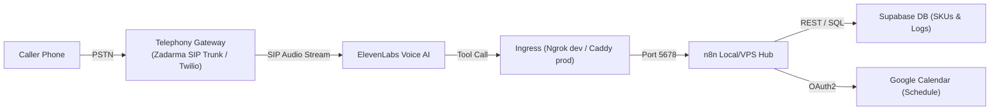
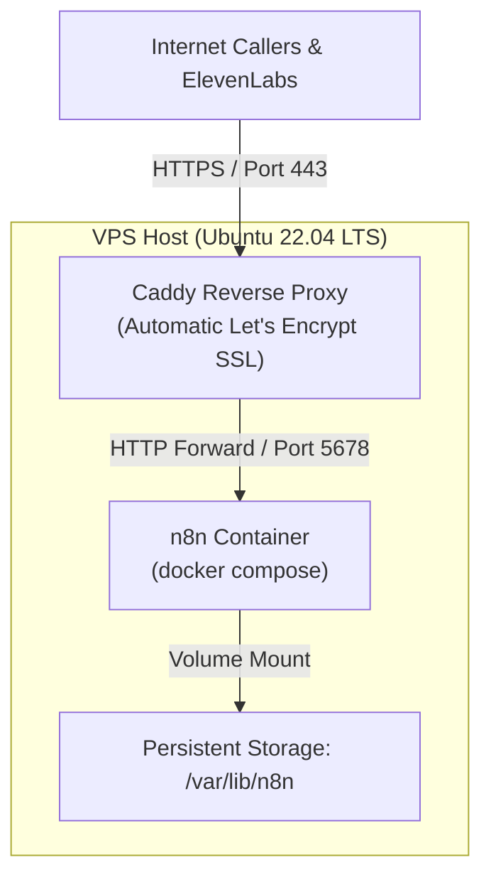

# Autonomous Inbound Call Admin Agent: Operations & Production Runbook

- **Target Audience:** Systems Engineers, Solution Architects, DevOps, Business Automation Operators
- **Version:** 1.0.0
- **Author:** Matteo Fabbri
- **Last Updated:** 2026-09-19

---

## 1. Executive Runbook Overview

This runbook details the end-to-end operational lifecycle of the **Inbound Call Admin Agent**. It provides explicit, tested instructions for:
1. **Local Development & Staging:** Running the containerized n8n engine with an ephemeral Ngrok tunnel for rapid prototyping and live test calling.
2. **Telephony & Voice Wiring:** Connecting Twilio inbound phone numbers to ElevenLabs Conversational AI and hooking up webhook tool calls.
3. **External Integrations:** Configuring Supabase Cloud PostgreSQL and Google Workspace OAuth2 calendar authentication.
4. **Production Deployment without Ngrok:** Transitioning to a secure, high-availability cloud VPS topology fronted by Caddy/Nginx with automated Let's Encrypt TLS/SSL.
5. **Rapid Client Onboarding Checklist:** White-labeling and launching the platform for a new client business in under 15 minutes.
6. **Incident Response & Troubleshooting:** Diagnosing latency spikes, webhook failures, auth mismatches, and audio dropouts.

---

## 2. Architecture & Service Inventory



| Component | Responsibility | Local Dev Host | Production Host | Authentication / Protocol |
| :--- | :--- | :--- | :--- | :--- |
| **Telephony Gateway** | Inbound PSTN/DID number, audio stream bridge | Zadarma SIP Trunk / Twilio | Zadarma SIP Trunk / Twilio | SIP Digest (`pbx.zadarma.com`) or Twilio Auth Token |
| **ElevenLabs** | Voice STT, LLM turn-taking, tool triggers, TTS | Cloud SaaS | Cloud SaaS | API Key / Conversational AI Agent ID |
| **Ingress** | Exposing n8n webhooks to ElevenLabs | Ngrok Free CLI | Caddy / Nginx Reverse Proxy | HTTPS / Let's Encrypt TLS |
| **n8n Engine** | Workflow orchestration, data mapping, tools | Docker Compose (`localhost:5678`) | Docker Compose (`VPS:5678`) | `X-Webhook-Secret` HTTP Header |
| **Supabase** | Product inventory catalog & historical call logs | Supabase Cloud (Free Tier) | Supabase Cloud (Free Tier) | Anon / Service Role Key (PostgREST) |
| **Google Calendar** | Real-time appointment check and event creation | Google Workspace | Google Workspace | Google OAuth 2.0 User Consent |

---

## 3. Phase 1: Local Development & Staging with Ngrok

### Step 1.1: Clone and Configure Environment
1. Clone the repository and change into the project root:
   ```bash
   cd /path/to/01_Inbound_Call_Admin_Agent
   ```
2. Copy the sample environment file to `.env`:
   ```bash
   cp .env.example .env
   ```
3. Generate a strong 32-character random string for `WEBHOOK_SECRET`:
   ```bash
   openssl rand -hex 16
   ```
   Paste this value into `.env` as `WEBHOOK_SECRET=your_generated_secret`.

### Step 1.2: Launch Local n8n Container
1. Validate the Docker Compose configuration:
   ```bash
   docker compose config
   ```
2. Start n8n in detached mode:
   ```bash
   docker compose up -d
   ```
3. Verify that the container is healthy and running on port `5678`:
   ```bash
   docker compose ps
   curl -I http://localhost:5678/healthz
   ```
   *(Expected response: HTTP/1.1 200 OK)*

### Step 1.3: Start Ngrok Webhook Tunnel
1. If not already installed, download [Ngrok](https://ngrok.com/) or install via package manager:
   ```bash
   brew install ngrok/ngrok/ngrok
   ```
2. Authenticate your free Ngrok account:
   ```bash
   ngrok config add-authtoken <YOUR_NGROK_AUTHTOKEN>
   ```
3. Start an HTTP tunnel to n8n port 5678:
   ```bash
   ngrok http 5678
   ```
4. Note your forwarding HTTPS URL (e.g., `https://abc-123.ngrok-free.app`).
5. Update `WEBHOOK_URL` in your `.env`:
   ```env
   WEBHOOK_URL=https://abc-123.ngrok-free.app/
   ```
6. Restart the n8n container to pick up the updated webhook base URL:
   ```bash
   docker compose up -d --force-recreate n8n
   ```

### Step 1.4: Import Workflow Templates into n8n
1. Open your browser and navigate to `http://localhost:5678`.
2. Follow the initial one-time setup to create your owner account.
3. Import the core workflows from `workflows/`:
   - Click **Workflows** > **Add Workflow** > **... (top right)** > **Import from File**.
   - Select `workflows/sku-lookup.json`.
   - Toggle workflow to **Active**.
   - Repeat for `workflows/calendar-check.json`, `workflows/calendar-book.json`, and `workflows/call-summary-logger.json`.

---

## 4. Phase 2: Telephony & Voice Configuration

### Step 2.1: Supabase Database Setup
1. Log in to [Supabase Cloud](https://supabase.com) and create a new project.
2. In the left sidebar, navigate to the **SQL Editor**.
3. Open `database/schema.sql` from this repository, paste the contents, and click **Run**.
4. Open `database/seed.sql`, paste the contents, and click **Run** to load sample inventory items.
5. In **Project Settings** > **API**, copy:
   - Project URL -> `SUPABASE_URL` in `.env`
   - `anon` `public` key -> `SUPABASE_ANON_KEY` in `.env`
   - `service_role` `secret` key -> `SUPABASE_SERVICE_ROLE_KEY` in `.env`

### Step 2.2: Google Calendar OAuth Setup in n8n (Self-Hosted)
Because self-hosted n8n operates independently, Google requires an OAuth 2.0 Client registered in Google Cloud Console:
1. In [Google Cloud Console](https://console.cloud.google.com), create/select a project and enable the **Google Calendar API** under **APIs & Services** > **Library**.
2. Go to **APIs & Services** > **OAuth consent screen**:
   - User Type: **External** -> Click **Create**.
   - Fill in App name, User support email, and Developer contact email.
   - Under **Test Users**, click **+ Add Users** and add the Google account whose calendar will be managed.
3. Go to **APIs & Services** > **Credentials** > **+ Create Credentials** > **OAuth client ID**:
   - Application Type: **Web application**.
   - Under **Authorized redirect URIs**, add:
     `https://<YOUR_WEBHOOK_URL>/rest/oauth2-credential/callback`
     *(For local testing with Ngrok: `https://abc-123.ngrok-free.app/rest/oauth2-credential/callback`)*
4. Click **Create** and copy your **Client ID** and **Client Secret**.
5. Inside n8n:
   - **Crucial:** Access n8n in your browser via your public Ngrok URL (`https://abc-123.ngrok-free.app`), **not** `localhost`. If connected via `localhost`, your browser will lack session cookies for the Ngrok callback domain, triggering `{"status":"error","message":"Unauthorized"}`.
   - Navigate to **Credentials** > **Add Credential** > **Google Calendar OAuth2 API**.
   - Paste your **Client ID** and **Client Secret**.
   - Click **Connect my account** / **Sign in with Google** and authorize your Google account. (If prompted with "Google hasn't verified this app" during testing, click *Advanced* > *Go to app*).
   - Once connected, click **Save**. (You can subsequently return to accessing n8n on `localhost:5678`).

### Step 2.3: ElevenLabs Conversational AI Agent Configuration
1. Log in to [ElevenLabs](https://elevenlabs.io) and open **Conversational AI** > **Create Agent**.
2. **System Prompt & Persona:**
   - Copy the directives from `elevenlabs/agent-prompt.md` and paste them into the **Prompt** field.
   - First message: *"Thank you for calling Acme Auto Care! My name is Alex. How can I help you today?"*
   - Voice: Select a natural conversational voice (e.g. *Rachel* or *Adam* with model *Eleven Turbo v2.5*).
3. **Knowledge Base:**
   - Customize `elevenlabs/business-faq-template.md` with client details.
   - Upload this document into the agent's **Knowledge Base** tab.
4. **Tools Setup (Webhooks):**
   In the **Tools** tab, add the 3 core tools (or paste the JSON from `elevenlabs/agent-config.json`):
   
   - **Tool 1: `lookup_sku`**
     - Description: *Look up product inventory, stock status, pricing, and item descriptions using a product SKU code or product name.*
     - Method: `POST`
     - URL: `https://<YOUR_WEBHOOK_URL>/webhook/sku-lookup`
     - Header: `X-Webhook-Secret`: `<YOUR_WEBHOOK_SECRET>`
     - Request Body: `{ "query": "string" }`

   - **Tool 2: `check_availability`**
     - Description: *Check open appointment slots on Google Calendar for a specific date.*
     - Method: `POST`
     - URL: `https://<YOUR_WEBHOOK_URL>/webhook/calendar-check`
     - Header: `X-Webhook-Secret`: `<YOUR_WEBHOOK_SECRET>`
     - Request Body: `{ "date": "string", "timezone": "string" }`

   - **Tool 3: `book_appointment`**
     - Description: *Book a confirmed appointment slot on Google Calendar.*
     - Method: `POST`
     - URL: `https://<YOUR_WEBHOOK_URL>/webhook/calendar-book`
     - Header: `X-Webhook-Secret`: `<YOUR_WEBHOOK_SECRET>`
     - Request Body: `{ "customer_name": "string", "customer_phone": "string", "date": "string", "time": "string", "service": "string" }`

### Step 2.4: Telephony Gateway Integration (Zadarma SIP Trunk or Twilio)

#### Option A: Zadarma SIP Trunking (Recommended for Flat-Rate & $0 Inbound Fees)
Zadarma connects to ElevenLabs via standard SIP Trunking without per-minute inbound carrier fees:
1. **Acquire Number & Note Credentials in Zadarma:**
   - Log in to [Zadarma Console](https://zadarma.com) and purchase a virtual number (DID) in your business's target country and area code.
   - Go to **Settings** > **SIP Connection** (or **My PBX** > **Extensions**).
   - Record your SIP credentials:
     - **SIP Server:** `pbx.zadarma.com`
     - **Extension / Login:** (e.g. `123456-100`)
     - **Password:** (your extension SIP password)
2. **Import SIP Trunk into ElevenLabs:**
   - In [ElevenLabs Dashboard](https://elevenlabs.io), navigate to **Conversational AI** > **Phone Numbers**.
   - Click **Import Number** > **From SIP Trunk**.
   - Fill in:
     - **Phone Number:** Your Zadarma number in standard E.164 format (e.g. `+15551234567` or `+390612345678`).
     - **SIP Server / Gateway:** `pbx.zadarma.com`
     - **Username:** Your Zadarma extension number.
     - **Password:** Your Zadarma extension password.
     - **Media Encryption:** `Disabled`.
   - Save and assign this phone number directly to your conversational AI agent.
3. **Configure Inbound Routing in Zadarma PBX:**
   - In Zadarma under **My PBX** > **Inbound Calls**, set the incoming call scenario for your virtual number to route directly to the extension configured in ElevenLabs.
   - *(Optional Fallback)*: Under PBX call scenarios, configure an overflow rule: if the extension does not answer within 15 seconds, forward the call to the business owner's mobile phone number.
4. Place a live test phone call to verify instant greeting pickup (<500ms voice turn).

#### Option B: Twilio Integration
1. In [Twilio Console](https://console.twilio.com), navigate to **Phone Numbers** > **Manage** > **Active numbers**.
2. Connect using ElevenLabs' native **Twilio Integration** (enter ElevenLabs Agent ID and Twilio credentials) or configure a TwiML Media Stream.
3. Place a test call to verify audio streaming.

---

## 5. Phase 3: Production Deployment without Ngrok

In a 24/7 production environment, Ngrok is eliminated. The system is hosted on a budget cloud VPS (e.g. Hetzner CX23, DigitalOcean Droplet, or Linode at $4–$6/month) fronted by Caddy for automated, zero-maintenance SSL certificates.



### Step 3.1: VPS Provisioning & DNS Configuration
1. Spin up an Ubuntu 22.04 LTS VPS instance (minimum 1 vCPU, 1 GB RAM, 25 GB SSD).
2. Point an **A Record** in your domain registrar (e.g., Cloudflare, Namecheap) to the VPS public IP:
   ```text
   n8n.clientdomain.com  ->  <VPS_PUBLIC_IP>
   ```

### Step 3.2: Install Docker and Caddy on VPS
SSH into your server and run:
```bash
# Update system
sudo apt update && sudo apt upgrade -y

# Install Docker & Docker Compose plugin
sudo apt install -y ca-certificates curl gnupg lsb-release
sudo mkdir -p /etc/apt/keyrings
curl -fsSL https://download.docker.com/linux/ubuntu/gpg | sudo gpg --dearmor -o /etc/apt/keyrings/docker.gpg
echo "deb [arch=$(dpkg --print-architecture) signed-by=/etc/apt/keyrings/docker.gpg] https://download.docker.com/linux/ubuntu $(lsb_release -cs) stable" | sudo tee /etc/apt/sources.list.d/docker.list > /dev/null
sudo apt update
sudo apt install -y docker-ce docker-ce-cli containerd.io docker-compose-plugin

# Install Caddy web server
sudo apt install -y debian-keyring debian-archive-keyring apt-transport-https
curl -1sLf 'https://dl.cloudsmith.io/public/caddy/stable/gpg.key' | sudo gpg --dearmor -o /usr/share/keyrings/caddy-stable-archive-keyring.gpg
curl -1sLf 'https://dl.cloudsmith.io/public/caddy/stable/debian.deb.txt' | sudo tee /etc/apt/sources.list.d/caddy-stable.list
sudo apt update
sudo apt install -y caddy
```

### Step 3.3: Configure Caddyfile (Automatic SSL)
Edit `/etc/caddy/Caddyfile`:
```caddy
n8n.clientdomain.com {
    reverse_proxy localhost:5678 {
        header_up Host {host}
        header_up X-Real-IP {remote_host}
        header_up X-Forwarded-For {remote_host}
        header_up X-Forwarded-Proto {scheme}
    }
}
```
Reload Caddy:
```bash
sudo systemctl reload caddy
```
Caddy automatically obtains and renews a trusted Let's Encrypt TLS certificate for `n8n.clientdomain.com`.

### Step 3.4: Production Docker Compose
On the VPS, clone the repo into `/opt/inbound-agent`, configure `.env`:
```env
N8N_PORT=5678
N8N_HOST=n8n.clientdomain.com
N8N_PROTOCOL=https
WEBHOOK_URL=https://n8n.clientdomain.com/
WEBHOOK_SECRET=<STRONG_SECRET>
BUSINESS_NAME=Acme Auto Care
BUSINESS_TIMEZONE=America/New_York
```
Start the service:
```bash
docker compose up -d
```

Update your ElevenLabs Agent tool URLs to `https://n8n.clientdomain.com/webhook/...`. Ngrok is now completely eliminated.

---

## 6. Phase 4: Client Onboarding Runbook (<15 Minutes)

When onboarding a new business client, execute this rapid checklist:

| Step | Time | Action | Files / Tools Used |
| :--- | :--- | :--- | :--- |
| **1. Telephony Number** | 2 min | Acquire local number in client's area code in Zadarma (or Twilio Console). | Zadarma / Twilio Console |
| **2. Clone Agent** | 2 min | In ElevenLabs, click "Duplicate Agent". Rename to `ClientName-Voice-Agent`. | ElevenLabs UI |
| **3. Knowledge Base** | 3 min | Fill out `elevenlabs/business-faq-template.md` with client's address, hours, and policies. Upload to agent. | Markdown / Text Editor |
| **4. SKU Seeding** | 3 min | Export client's product/price list as CSV or insert via Supabase Table Editor. | Supabase Table Editor |
| **5. Google Calendar** | 3 min | In n8n, create a new Google Calendar credential connecting the client's Google account. Select target calendar. | n8n Credentials |
| **6. Verification Call**| 2 min | Call the client's business number, ask an FAQ, check an SKU, and schedule a test booking. | Telephone |
| **Total Time** | **15 min** | **Client is 100% operational with 24/7 automated call answering.** | |

---

## 7. Troubleshooting & Diagnostic Playbook

### Issue A: "Dead Air" or Agent Pauses for >2 Seconds
- **Root Cause:** ElevenLabs is waiting on n8n webhook response before delivering TTS, or n8n is making slow sequential queries.
- **Diagnostic Action:**
  1. Verify n8n workflow uses the **Respond to Webhook** node immediately.
  2. Inspect n8n execution timing in **Executions** tab. Workflow execution should be <300ms.
  3. Ensure system prompt includes the mandatory filler acknowledgment directives from `elevenlabs/agent-prompt.md`.

### Issue B: HTTP 401 Unauthorized from n8n Webhook
- **Root Cause:** `X-Webhook-Secret` header in ElevenLabs tool setting does not match `WEBHOOK_SECRET` in `.env`.
- **Diagnostic Action:**
  1. Test endpoint manually using `curl`:
     ```bash
     curl -i -X POST https://<YOUR_URL>/webhook/sku-lookup \
       -H "Content-Type: application/json" \
       -H "X-Webhook-Secret: <YOUR_SECRET>" \
       -d '{"query": "SKU-1001"}'
     ```
  2. If 401 occurs, verify exact casing of `WEBHOOK_SECRET` in `.env`.

### Issue C: Google Calendar Slot Conflicts or Timezone Drift
- **Root Cause:** The server host is in UTC while the business is in a local timezone, or daylight savings offset is missing.
- **Diagnostic Action:**
  1. Ensure `GENERIC_TIMEZONE` and `TZ` are specified in `docker-compose.yml` (e.g. `America/New_York` or `Europe/Rome`).
  2. Verify start/end times in Google Calendar web interface match the requested booking hour.

### Issue D: Ngrok Session Expired (Local Dev)
- **Root Cause:** Free-tier Ngrok tunnel was restarted, generating a new ephemeral URL.
- **Diagnostic Action:**
  1. Restart Ngrok: `ngrok http 5678`.
  2. Copy new forwarding URL to `WEBHOOK_URL` in `.env` and update the 3 tool URLs in ElevenLabs.
  3. *(For persistent development, reserve a free static domain in Ngrok dashboard: `ngrok http --domain=xyz.ngrok-free.app 5678`).*

### Issue E: {"status":"error","message":"Unauthorized"} During Google OAuth Callback
- **Root Cause:** The administrator initiated the Google OAuth flow while browsing n8n on `http://localhost:5678`. Because the callback URL registered with Google points to the public Ngrok domain (`https://xyz.ngrok-free.app/rest/oauth2-credential/callback`), Google returns the browser to Ngrok where the user has no active session cookies.
- **Diagnostic Action:**
  1. Open a new browser tab and navigate directly to your public Ngrok URL: `https://<YOUR_NGROK_DOMAIN>`.
  2. If using free Ngrok, click **Visit Site** on the interstitial splash screen.
  3. Log into your n8n account on the Ngrok domain.
  4. Open **Credentials** > **Google Calendar OAuth2 API** and click **Connect my account** / **Sign in with Google**.
  5. The callback will now match your active session and connect successfully.
