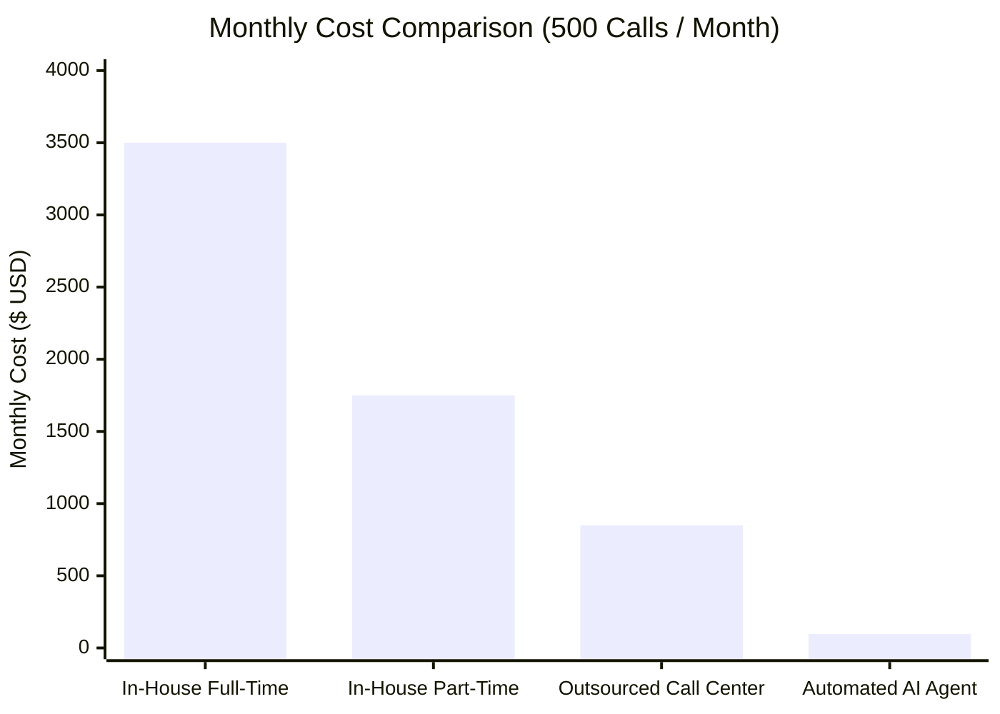
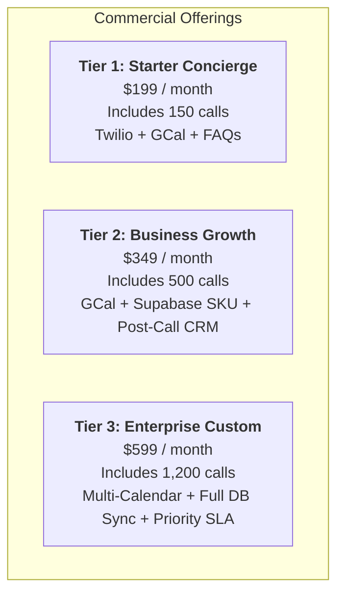

# Commercial Analysis: Autonomous Inbound Call Admin Agent

- **Project:** Modular Local / Self-Hosted n8n Inbound Call Admin Agent
- **Stack:** Twilio (Telephony) + ElevenLabs (Conversational Voice AI) + n8n (Workflow Orchestration) + Supabase (Product/SKU Database) + Google Calendar (Scheduling)
- **Author:** Matteo Fabbri
- **Date:** September 19, 2026
- **Status:** Complete / Decision-Ready

---

## 1. Executive Summary

This document provides a comprehensive commercial, financial, and operational evaluation of replacing or augmenting traditional front-office phone handling with an automated **Inbound Call Admin Agent**.

### Core Thesis
Small and mid-sized businesses (SMBs)—such as medical/dental clinics, auto repair shops, beauty salons, professional service firms, and specialty retailers—lose between **30% and 50% of potential inbound customer inquiries and appointment bookings** due to missed calls, after-hours voicemails, and busy lines. At the same time, front-office personnel spend **40% to 65% of their working hours** fielding repetitive tier-1 inquiries: checking business hours, confirming product SKU pricing and availability, and scheduling appointments.

By leveraging an architecture composed of **Twilio**, **ElevenLabs Conversational AI**, self-hosted **n8n**, **Supabase Cloud**, and **Google Calendar**:
- **Fixed Infrastructure Costs** are driven down to **~$10 to $28 per month** per business.
- **Variable Call Costs** operate at **~$0.09 per minute** (yielding an effective cost of **$0.15 to $0.25 per completed call**).
- **Labor Savings** recover **15 to 25 hours per week** of human administrative capacity per location.
- **Revenue Recovery** captures an estimated **$1,200 to $4,500 per month** in otherwise lost after-hours appointments and sales conversions.
- **Gross Margins** for commercializing this solution as a managed service range between **75% and 88%**.

---

## 2. Technical Stack Cost Breakdown

The solution is purposefully designed to avoid proprietary monolithic platforms, minimizing licensing overhead while ensuring enterprise-grade reliability and modularity.

```mermaid
flowchart LR
    Caller["Inbound Caller"] -->|PSTN Phone Call| Telephony["Telephony Gateway<br/>(Zadarma: $2/mo, $0/min | Twilio: $1.15/mo + $0.0085/min)"]
    Telephony -->|SIP / Audio Stream| ElevenLabs["ElevenLabs Conversational AI<br/>($0.08/min overage)"]
    ElevenLabs -->|Tool Webhook (HTTP POST)| n8n["n8n Orchestration<br/>(Self-Hosted VPS $5/mo)"]
    n8n -->|Catalog / SKU Query| Supabase["Supabase DB<br/>(Free Tier $0/mo)"]
    n8n -->|Check / Book Slot| GCal["Google Calendar<br/>(Free OAuth2 $0/mo)"]
    n8n -->|Instant Response| ElevenLabs
    ElevenLabs -->|Natural Voice Audio| Caller
```

### Component Cost Dynamics

| Service | Function | Local Dev / Testing | Production Deployment (Per Client) | Billing Model & Quota Limits |
| :--- | :--- | :--- | :--- | :--- |
| **Zadarma (Recommended)** | Telephony (Virtual number, SIP Trunk) | ~$2.00 / mo | **~$2.00 – $3.00 / mo** (Local DID) | **$0.00 / min inbound** on most DIDs (unlimited incoming calls included). Simplified global/EU compliance. |
| **Twilio (Alternative)** | Telephony (Phone number, PSTN routing) | ~$1.15 / mo + usage | **~$1.15 / mo** (US) + **$0.0085 / min** | Inbound rate billed in 60s increments ($0.015–$0.035/min for EU numbers). |
| **ElevenLabs** | Real-time voice agent (STT + LLM + TTS) | $0 (Free Tier 15 min) | **$6.00 – $22.00 / mo** (Starter/Creator base) or **$0.0800 / min** overage | Starter includes 75 min ($6/mo); Creator includes 275 min ($22/mo); Pro includes 1,238 min ($99/mo). Overage is fixed at $0.08/min. |
| **n8n Hosting** | Business logic, tool webhooks, API routing | $0 (Local Docker Compose) | **$4.00 – $6.00 / mo** (Hetzner CX23 / DigitalOcean VPS) | n8n Community Edition is fair-code / free to self-host. No per-workflow or execution fees. |
| **Supabase** | Product SKU catalog, stock counts, call logs | $0 (Free Tier) | **$0.00 / mo** (Free Tier) | Free tier provides 500 MB DB storage (stores >50,000 SKUs), 50,000 monthly active rows, and 5 GB egress. |
| **Google Calendar** | Availability search & appointment insertion | $0 | **$0.00 / mo** | Google Calendar API is included with any Google Workspace or personal Google account. 1,000,000 queries/day. |
| **Ingress / SSL** | Secure webhook exposure | $0 (Ngrok Free Tier) | **$0.00 / mo** (Direct domain + automated Let's Encrypt SSL via Caddy/Nginx) | Ngrok is eliminated in production; domain DNS A-record points to the VPS. |
| **Total Fixed Overhead** | Base monthly operational baseline | **~$2.00 / mo** | **~$11.00 – $30.00 / mo** | Highly scalable with near-zero baseline commitment. |

---

## 3. Unit Economics & Monthly Cost Modeling

### Per-Minute Blended Rate Calculation
When an inbound call is active:
- **Zadarma Telephony:** **$0.0000 / minute** (free incoming on most virtual numbers)
- *(Twilio Alternative: $0.0085 / minute)*
- **ElevenLabs Conversational AI:** $0.0800 / minute
- **Total Blended Cost per Connected Minute:** **$0.0800 / minute** (with Zadarma) or **$0.0885 / minute** (with Twilio)

A standard front-office interaction (e.g., verifying store inventory or booking an appointment) averages **1.5 to 2.5 minutes**. Thus, the net infrastructure cost to complete an entire administrative interaction is:
$$\text{Cost per Call (Zadarma)} = 2.0 \text{ minutes} \times \$0.0800 \approx \mathbf{\$0.160 \text{ (16 cents)}}$$

### Monthly Operational Cost Scenarios

| Business Profile | Monthly Call Volume | Total Minutes (~2.0 min/call) | Fixed Hosting (VPS + Twilio #) | ElevenLabs Subscription + Overage | Twilio Usage Fees | Total Monthly Operating Cost | Effective Cost per Completed Call |
| :--- | :--- | :--- | :--- | :--- | :--- | :--- | :--- |
| **Micro / Boutique** (e.g. Solo salon, dental specialist) | **100 calls** | 200 min | $7.15 | $22.00 *(Creator tier: 275m included)* | $1.70 | **$30.85 / mo** | **$0.31** |
| **Small Business** (e.g. Auto repair shop, busy clinic) | **500 calls** | 1,000 min | $7.15 | $22.00 + $58.00 *(725m overage)* | $8.50 | **$95.65 / mo** | **$0.19** |
| **Medium / Busy** (e.g. Multi-chair clinic, retail depot) | **1,200 calls** | 2,400 min | $7.15 | $99.00 *(Pro tier: 1,238m) + $92.96 (overage)* | $20.40 | **$219.51 / mo** | **$0.18** |
| **High Volume / Depot** (e.g. High-traffic trade supplier) | **2,500 calls** | 5,000 min | $7.15 | $99.00 + $300.96 *(3,762m overage)* | $42.50 | **$449.61 / mo** | **$0.18** |

---

## 4. Competitive Analysis: AI Agent vs. Traditional Front-Office Practices



### Comprehensive Comparison Matrix

| Operational Dimension | Status Quo 1: In-House Front-Office Staff | Status Quo 2: Outsourced Call Center (BPO) | Automated Inbound Call Admin Agent |
| :--- | :--- | :--- | :--- |
| **Direct Monthly Cost** | **$2,500 – $4,000 / mo** ($18–$25/hr + taxes, benefits, space) | **$600 – $1,200 / mo** ($1.25–$2.50 / minute or rigid call bundles) | **$30 – $100 / mo** (Usage-based infrastructure cost) |
| **Hours of Coverage** | 40 hours/week (Mon–Fri, 9am–5pm). Zero night or weekend coverage. | Typically 24/7 or extended hours. | **168 hours/week (24/7/365)**. Zero downtime on holidays or nights. |
| **Concurrent Call Capacity** | **1 call at a time** per staff member. Subsequent callers get busy signal or voicemail. | Shared operator pool (variable wait times, hold queues). | **Virtually unlimited concurrency** (50+ simultaneous calls answered on Ring 1). |
| **Hold Times & Latency** | 30s to 5 minutes during peak walk-in / lunch hours. | 45s to 2 minutes in queue. | **< 1.0 second pickup**. Zero hold time. |
| **Data Synchronization** | Manual data entry into CRM/Calendar; susceptible to typos and delays. | Operator takes notes, emails client; business must manually input later. | **Direct two-way synchronization** via n8n into Supabase & Google Calendar in real time. |
| **Product Knowledge / SKUs** | Requires extensive onboarding; staff may give outdated pricing or stock. | Limited to generic script; cannot query live inventory databases. | **Instant live database query** against Supabase; 100% accurate on stock and price. |
| **Call Abandonment Rate** | **30% – 50%** of calls go unanswered during rushes or after-hours. | 10% – 15% drop-off in queue. | **< 1%** (Answered immediately). |
| **Turnover & Onboarding** | High turnover in receptionist roles; ongoing hiring and training costs. | Ongoing contract renegotiations and QA monitoring. | **Durable asset**: setup once, updates made via prompt/FAQ template. |

---

## 5. Productivity, Efficiency & Revenue Impact Analysis

### 1. Revenue Recovery (The Hidden Cost of Missed Calls)
- **Industry Benchmark:** According to telecoms and CRM industry studies (Invoca, Zendesk), **67% of callers who reach a voicemail do not leave a message**; they hang up and dial the next competitor on Google search results.
- **Scenario Calculation for a Local Service Business (e.g., Dental, Auto Repair, Salon):**
  - Average Monthly Inbound Calls: 500
  - Missed Call Rate (After-hours, lunch, busy lines): 30% = 150 missed calls
  - Callers who abandon without leaving voicemail: 67% of 150 = **100 lost prospects**
  - Conservative Conversion Rate if answered live: 15% = **15 captured customers**
  - Average Customer Lifetime / Ticket Value: $150
  - **Recovered Monthly Gross Revenue: $2,250 / month ($27,000 / year)**.
- **ROI Conclusion:** Capturing just **1 single customer per month** pays for the entire operational cost of the AI agent for that month.

### 2. Labor Reallocation & Focus Dividend
- **Current Burden:** Front-office staff spend an average of **2.5 to 3.5 hours per day** answering simple, repetitive questions:
  - *"Are you open today?"*
  - *"How much is service X or product SKU Y?"*
  - *"Can I come in Thursday at 3 PM?"*
- **Operational Savings:**
  - Automated offloading saves ~15 hours per week per staff member.
  - At $20/hour, this represents **$1,200/month in reclaimed labor value**.
  - Front-office personnel can redirect this time to in-person patient/client check-ins, upselling services, or resolving complex escalations.

### 3. Error Reduction & Conflict Prevention
- Humans frequently double-book or misread timezones during busy desk shifts.
- n8n’s calendar check algorithm checks live Google Calendar free/busy slots atomically, ensuring zero double-bookings and programmatic adherence to business buffers.

---

## 6. Commercial Packaging & Go-to-Market (GTM) Strategy

If offering this solution as a commercial B2B product or AI automation service to local businesses, the following packages provide exceptional value to the client while securing high software gross margins (75%–85%).

### Recommended Client Pricing Tiers



| Package | Target Client | Monthly Client Price | Underlying COGS (API & Server) | Gross Margin ($) | Gross Margin (%) | Key Value Delivered |
| :--- | :--- | :--- | :--- | :--- | :--- | :--- |
| **Starter Concierge** | Boutique clinics, independent salons, solo consultants | **$199 / mo** | ~$35.00 | **+$164.00 / mo** | **82.4%** | 24/7 call answering, FAQ resolution, Google Calendar booking, SMS confirmation. |
| **Business Growth** | Auto service centers, dental practices, specialty retailers | **$349 / mo** | ~$95.00 | **+$254.00 / mo** | **72.8%** | All Starter features + live Supabase SKU lookup + post-call transcript logging + call audio recordings. |
| **Enterprise Custom** | Multi-location practices, high-volume contractors | **$599 / mo** | ~$180.00 | **+$419.00 / mo** | **69.9%** | High call volume, multi-calendar routing, priority uptime monitoring, custom prompt revisions. |

### Additional Revenue Streams
1. **One-Time Implementation & Setup Fee:**
   - **$750 – $1,500** per business for configuring the Twilio phone number, seeding their initial SKU database in Supabase, hooking up their Google Workspace Calendar, and tuning the ElevenLabs prompt voice personality.
2. **Usage Overage Pass-Through:**
   - Bill clients **$0.20 per minute** for minutes exceeding their package threshold (underlying cost is ~$0.09/min, generating a 55% margin on overage).

---

## 7. Financial Sensitivity & Risk Management

| Risk Factor | Financial / Operational Impact | Architectural & Commercial Mitigation |
| :--- | :--- | :--- |
| **Long-Winded Callers or Pranksters** | Extended call duration causing unnecessary ElevenLabs per-minute charges. | **1. Hard Session Timer:** Enforce maximum call length (e.g. 5 minutes) via ElevenLabs agent settings.<br/>**2. Prompt Guardrails:** Instruct agent to politely conclude or transfer calls when resolution is achieved.<br/>**3. Rate Limiting:** Twilio firewall rules to block abusive caller numbers. |
| **Provider Price Increases** | Potential margin compression if ElevenLabs or Twilio alter rates. | Modular n8n architecture allows swapping the voice layer (e.g. to Deepgram/Cartesia or Retell AI) or telephony layer (Telnyx/Vonage) without rewriting business database logic. |
| **Free-Tier Deprecation** | Supabase or Google introducing unexpected charges. | Self-hosted PostgreSQL container is already architected in Docker Compose as a 100% offline, zero-cost alternative if cloud DB terms shift. |
| **Misunderstood Inquiries / Hallucinations** | Caller frustrated by incorrect inventory response or misheard appointment date. | **1. Phonetic SKU Guidance:** Prompt forces agent to repeat dates and spell SKUs back to caller for confirmation.<br/>**2. Warm Fallback:** If confidence is low or caller asks twice, agent triggers Twilio `<Dial>` to forward the call to a human backup line. |

---

## 8. Strategic Conclusion & Verdict

| Financial Metric | Traditional Receptionist | Inbound Call Admin Agent | Net Advantage |
| :--- | :--- | :--- | :--- |
| **Annual Operating Cost** | $30,000 – $45,000 / year | **$1,140 – $2,600 / year** | **94% – 97% Cost Reduction** |
| **Missed Call Rate** | 30% – 50% | **< 1%** | **Near-Complete Capture** |
| **Availability** | 40 hours/week | **168 hours/week** | **+320% Increased Availability** |
| **Estimated Net ROI** | Baseline overhead | **10x to 25x ROI** (via recovered revenue + labor efficiency) | **Immediate Positive Payback** |

**Final Recommendation:**
The project represents an exceptional asymmetric investment: technical implementation costs and operating overhead are negligible (<$100/mo), while operational productivity gains and revenue capture exceed $2,000–$4,000/month per business. The modular architecture (separating voice, logic, and database) ensures long-term viability, portability, and high commercial margins.
